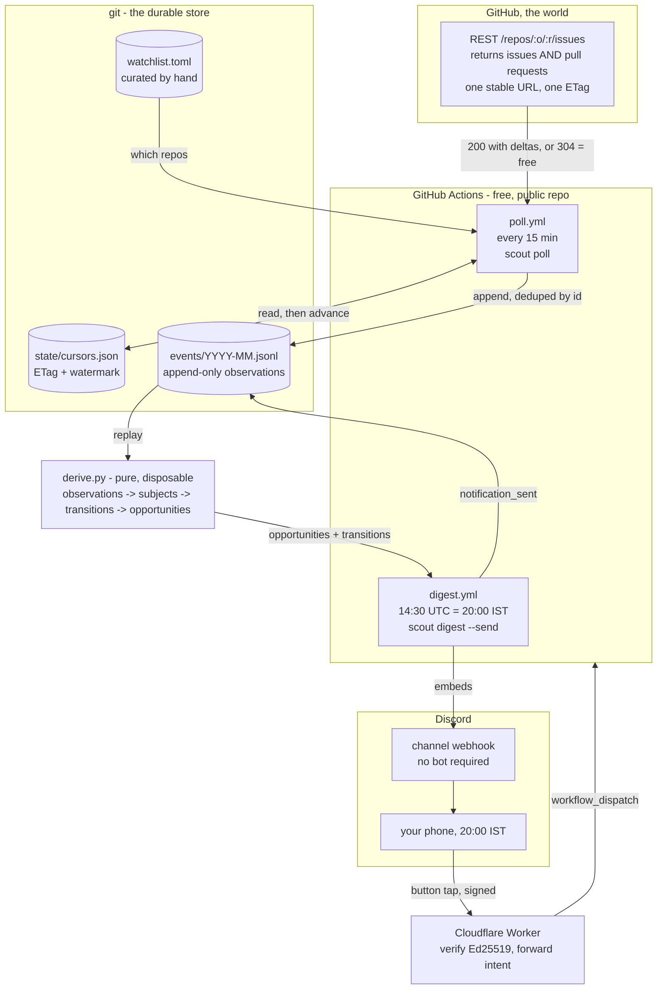

# scout

Find open source repositories worth contributing to, and prove you can build them.

Read-only against GitHub, deliberately. Nothing here posts a comment, claims an issue,
or opens a pull request. Those come later, and only behind a human tap.

## The problem it solves

Finding "beginner friendly" issues is not the bottleneck. Two other things are:

- **Most popular repositories will not merge your patch.** They have a public issue
  tracker and a closed contributor list, and nothing on the repository page tells you
  which kind you are looking at.
- **A repository you cannot build is a repository you cannot contribute to**, whatever
  the issue tracker looks like. If getting to a green test suite takes forty minutes,
  you will never do it on a weeknight.

`scout probe` answers the first in three API calls. `scout mark` records the answer to
the second, once, so you never rediscover it.

## The number that matters

`cold_merges` — pull requests merged in the last 180 days whose author had **never
contributed to that repository before**. GitHub exposes this as `authorAssociation` on
every PR, and almost nobody looks at it.

A project with 40,000 stars and zero cold merges in six months is a closed shop. It will
happily take your bug report and never take your patch. That single number would have
saved most people their first three wasted weekends.

Stars are reported, but nothing is scored on them.

## Verdicts

| | meaning |
|---|---|
| `DEAD` | archived, issues disabled, or no push in 120 days |
| `TRAP` | active and popular, but does not merge outsiders or answer them |
| `THIN` | too few merges in the window to judge — come back later |
| `VIABLE` | nothing disqualifying, with caveats printed |
| `GOOD` | 3+ first-timers merged and a quarter of merges from outside |

## Running it

```bash
cp .env.example .env      # then put a PAT in SCOUT_GITHUB_TOKEN
uv sync
uv run scout doctor
```

```bash
uv run scout probe pola-rs/polars           # score one repo, print the card
uv run scout add astral-sh/ruff --why "I use it daily"
uv run scout list                           # the watchlist, cached, no network
uv run scout refresh                        # re-probe everything, report downgrades
```

Once you have actually built one:

```bash
uv run scout mark astral-sh/ruff green --setup "cargo build" --test "cargo test" --minutes 9
```

A classic or fine-grained PAT with `public_repo` is enough. Three queries per repository,
roughly 3 of the 5000 rate-limit points you get an hour, so refreshing a thirty-repo
watchlist hourly is free.

## What else a probe finds

While scoring, scout collects work that nobody is racing for:

- **stale assignments** — open, assigned 21+ days, no linked pull request. A polite "is
  this still being worked on?" has a high hit rate.
- **abandoned pull requests** — open 30+ days, author gone, not a draft, not from a
  maintainer. Often 80% finished.

These are reported per repository, not aggregated, because acting on them is a decision
you make per project.

## Timezone

Two numbers, and they are not equally trustworthy.

`free_hour_overlap` is **measured**: the fraction of maintainer comment timestamps that
fall inside `SCOUT_FREE_HOURS_LOCAL`, converted to IST. If it is near zero, every round
trip on that project costs you a day.

`maintainer_utc_offset` is a **guess** — an activity peak, assumed to sit at 14:00 local.
Good enough to tell Europe from the Americas, not good enough to trust further. Prefer
the overlap.

## The watchlist

`watchlist.toml` is curated data, hand-edited and committed — not configuration, which is
why secrets live in the environment and this does not. It is meant to stay short enough
to read on one screen. Five repositories you can build beat five hundred you cannot.

`status` moves `candidate → building → green → active`, or `rejected`. Only `green` and
`active` are `actionable`: alerts about anything else waste the evening, and the later
notification phase will filter on exactly that field.


## How it all fits together



### What each piece is for

| piece | job | why it and not something else |
|---|---|---|
| **`watchlist.toml`** | the 5-25 repos worth watching, hand-curated | committed data, not config. Five you can build beat five hundred you cannot |
| **GitHub REST API** | one call per repo returns issues *and* PRs | `/issues` includes PRs, so one URL and one ETag cover both. A 304 costs no rate limit at all |
| **`state/cursors.json`** | per-repo ETag and watermark | bookmarks, not facts. Deliberately **not** in the event log - delete it and the next poll just re-reads a page, and dedupe drops it |
| **`events/*.jsonl`** | append-only observations, the only durable asset | git is already an append-only log with history and durability. A database would add a thing to back up for a few MB a year |
| **`derive.py`** | rebuilds subjects, transitions and opportunities | pure and disposable. Delete it, replay, get it back. Conclusions never go in the log, so fixing how one is drawn can be replayed over history |
| **Actions `poll.yml`** | runs the poller every 15 min, commits the log | free on a public repo, and the log commit is also what stops GitHub disabling the schedule after 60 idle days |
| **Actions `digest.yml`** | once a day, builds and sends | **observing and interrupting are different decisions.** Poll often for an accurate log; interrupt once, when you can act |
| **Discord webhook** | delivers the digest as embeds | needs no bot, no OAuth, no application. Create it in the UI, POST JSON at it |
| **Cloudflare Worker** | catches button taps | Discord wants an answer in 3 seconds; a cron job cannot give one. Stateless on purpose - nothing to keep consistent with the log |
| **Heroku** | *not used* | dyno filesystems are ephemeral, so JSONL on disk cannot survive a restart. Git does the job better and free |

### The path of one observation

1. **15 min tick.** `poll.yml` runs `scout poll`. It reads `watchlist.toml`, skips anything not `green`/`active`, and checks the safety guards.
2. **One GET per repo**, carrying last poll's ETag. Unchanged means **304, zero rate limit**, and the walk stops there.
3. **Changed means a page of rows**, newest-updated first. Scout walks down until it hits the watermark, then stops.
4. **Each row becomes an observation** whose id is `hash(kind, repo, number, updated_at)` - identity is *what it saw*, not *when it looked*. Two overlapping polls write one row.
5. **Appended and committed.** New ids only; a second run writes 0.
6. **`derive.py` replays the log.** Last observation per subject wins, and consecutive pairs are diffed into transitions - `unassigned`, `labeled`, `merged`.
7. **Opportunities are computed** from current state: stale assignments, abandoned PRs, unanswered reports. Beginner-labelled issues are excluded on purpose.
8. **20:00 IST.** `digest.yml` ranks it, drops anything already sent, posts up to 8 embeds.
9. **A tap** hits the Worker, which verifies the signature and queues a `workflow_dispatch`. Nothing reaches GitHub without you.

## Polling

Two knobs, and conflating them is how you end up muting the channel:

- **Observing** runs every 15 minutes so the event log stays accurate.
- **Interrupting** runs once, at 20:00 IST, when there is time to act on it.

```bash
uv run scout poll            # fetch deltas, append observations
uv run scout digest          # build the evening digest, print it
uv run scout digest --send   # ... and post it to Discord
uv run scout events          # counts by kind, log size
uv run scout replay --check  # rebuild derived state twice, prove it matches
```

`poll` is safe to run twice: the second run writes 0. An observation is identified by the
version of the thing it saw, so overlapping polls dedupe themselves.

One repo per poll is usually **one request that comes back 304 and costs no rate limit at
all**. That only works because the URL is stable - a moving `since=` parameter would
invalidate the ETag every time, so the poller uses a fixed URL and stops reading at a
watermark instead. Ten repos every 15 minutes is 40 requests an hour against a limit of
5000. The rate limit is not the constraint here and never will be.

Three gates decide what gets polled, and all must pass: the repo is in `watchlist.toml`,
its `status` is `green` or `active` (because `poll_only_actionable` defaults true), and
its `poll` field is true. `scout poll --all` relaxes the second one for a single run;
`poll = false` is the hand-edited mute for a repo that is mid-release-week and too loud.

## The event log

`events/YYYY-MM.jsonl`, append-only, committed to git. Git is already a durable
append-only log with history, so the asset lives there rather than in a database.

**GitHub's API returns state, not events.** A poll says what an issue looks like now, not
what happened to it. So the log holds *observations* - one snapshot of one subject at one
moment - and every transition ("just came free", "went stale") is derived by comparing
consecutive observations. Recording transitions directly would put conclusions in the
log, and a later fix to how a conclusion is drawn could not then be replayed.

Everything in `derive.py` is disposable. Delete it, replay, get it back:

```bash
uv run scout replay --check
```

`state/cursors.json` is deliberately **not** in the log. An ETag is a note about where
this machine got to, not a fact about the world. Delete it and the next poll re-reads one
page it has already seen; the event ids dedupe it away.

## What gets surfaced

Not beginner-labelled issues. Those are the most contested real estate on GitHub and the
race for them is unwinnable from IST. Instead:

| | why nobody is racing for it |
|---|---|
| `unassigned` | someone claimed it, then let it go - wanted work, now free, no race |
| `unanswered-report` | an outsider's bug report with no reply; reproduce it and you are a name the maintainers know |
| `stale-assignment` | assigned 21+ days, untouched |
| `abandoned-pr` | open 30+ days, author gone, often 80% finished |

## Hosting

Three needs, three different answers:

See the table above for what runs where. Two operational caveats worth knowing:

Actions' scheduled workflows are best-effort and routinely run late, which costs nothing
here because the digest is batched to your evening anyway. Note that GitHub disables
schedules after 60 days of repository inactivity; the log commit on each poll is what
keeps them alive.

Heroku was considered and rejected for the log: **dyno filesystems are ephemeral**, so
JSONL on disk cannot survive a restart, and Postgres to work around that is $5/mo for
something git does better and for free.

## Setup, start to finish

### 1. GitHub — the token

Create a **fine-grained PAT** at Settings → Developer settings → Personal access tokens.

- Repository access: **Public repositories (read-only)**
- Permissions: nothing else. Scout never writes, and the code refuses to.

Copy it. This is `SCOUT_GITHUB_TOKEN`.

> A classic token with `public_repo` also works but grants far more than scout needs.
> Prefer the fine-grained one.

### 2. GitHub — the repository

Push this repo **public**. Public repositories get unlimited free Actions minutes;
a private one gets 2,000/month, which a 15-minute cadence does not fit (see Cost below).

Then add the secrets under Settings → Secrets and variables → Actions:

| secret | value |
|---|---|
| `SCOUT_GITHUB_TOKEN` | the PAT from step 1 |
| `SCOUT_DISCORD_WEBHOOK_URL` | from step 3 |

Check Settings → Actions → General → Workflow permissions is **Read and write**, or the
poll job cannot commit the log.

### 3. Discord — the webhook (notifications)

No bot, no application, no OAuth.

1. Make a private server for yourself (the `+` in Discord's sidebar → Create My Own).
2. Create a channel, say `#scout`.
3. Channel settings (gear) → **Integrations** → **Webhooks** → **New Webhook**.
4. **Copy Webhook URL**. That is `SCOUT_DISCORD_WEBHOOK_URL`.

Test it before wiring anything up:

```bash
uv run scout digest          # prints what it would send
uv run scout digest --send   # actually posts
```

### 4. Discord — the application (buttons, optional)

Only needed once you want to tap buttons. Skip until phase 3.

1. <https://discord.com/developers/applications> → **New Application**.
2. **General Information** → copy the **Public Key** → `DISCORD_PUBLIC_KEY`.
3. Leave **Interactions Endpoint URL** blank for now; you fill it in after step 5.

### 5. Cloudflare — the receiver (buttons, optional)

```bash
npm install -g wrangler
cd worker
wrangler login
wrangler secret put DISCORD_PUBLIC_KEY   # from step 4
wrangler secret put GITHUB_TOKEN         # a SECOND fine-grained PAT: Actions read+write, THIS repo only
wrangler secret put GITHUB_REPO          # e.g. yourname/scout
wrangler deploy
```

Paste the deployed `https://scout-interactions.<you>.workers.dev` into the Discord
application's **Interactions Endpoint URL**. Discord immediately sends a PING and refuses
to save the URL unless it gets a signed PONG and a 401 for a bad signature — so if it
saves, verification works.

Free tier is 100k requests/day. You will use a handful.

### 6. First run

```bash
cp .env.example .env        # fill in SCOUT_GITHUB_TOKEN
uv sync
uv run scout doctor         # token, budget, safety settings
uv run scout add pola-rs/polars --why "I use it daily"
```

Probe 10-15 repos, build the good ones, and mark them:

```bash
uv run scout mark pola-rs/polars green --setup "cargo build" --test "cargo test" --minutes 9
```

**Nothing is polled until at least one repo is `green`** — `poll_only_actionable`
defaults true, on the principle that an alert about a repo you cannot build wastes the
evening. Then:

```bash
uv run scout poll
uv run scout digest
```

Once that looks right locally, the workflows take over.

## Cost, and how it is kept at zero

| | free tier | what scout uses |
|---|---|---|
| GitHub API | 5,000 req/hour | ~40/hour, most of them 304s |
| Actions (public repo) | unlimited | ~96 runs/day at well under a minute |
| Actions (private repo) | 2,000 min/month | **~2,880 — does not fit.** Use a public repo, or drop to a 30-minute cadence |
| Cloudflare Workers | 100k req/day | a handful of button taps |
| Discord webhook | free | one message a day |

Actions bills each job rounded up to the whole minute, which is why a 15-minute cadence
overruns a private repo's allowance even though each run takes seconds. If you must keep
it private, change the cron to `*/30` and set an Actions spending limit of $0.

## Safety

Five guards, each placed where a mistake would otherwise be silent. They refuse loudly
rather than degrading quietly, and every one has a test.

| guard | what it stops | setting |
|---|---|---|
| **Read-only enforcement** | any `POST`/`PUT`/`PATCH`/`DELETE` to GitHub, and any GraphQL document containing `mutation` | structural — a client must be built `read_only=False` on purpose |
| **Rate-limit floor** | polling on until the token is throttled, which looks like abuse from GitHub's side | `SCOUT_RATE_LIMIT_FLOOR=500` |
| **Repo cap** | a watchlist that quietly grew to 200 repos | `SCOUT_MAX_POLL_REPOS=25` |
| **Kill switch** | everything, without touching a schedule | `SCOUT_ENABLED=false` |
| **Job timeout** | a hung run burning minutes | `timeout-minutes: 10` |

The read-only guard is the one that matters. Scout's whole position is that it does not
act on GitHub without a human tap, and **an auto-commenting bot is exactly the behaviour
that got open source communities gated in the first place.** That promise is enforced by
something that fails loudly, not by everyone remembering.

## Is any of this against GitHub policy?

**The API usage: no, and not close.** Authenticated, read-only, official API, roughly 40
requests an hour against a 5,000 limit, honouring ETags so most cost nothing. The scraping
restrictions in the Acceptable Use Policies are aimed at unauthenticated bulk harvesting
and reselling personal data.

**Actions: technically grey, practically fine.** The Terms for Additional Products say
Actions on hosted runners should not be used for "activity unrelated to the production,
testing, deployment, or publication of the software project associated with the
repository". Read strictly, a cron polling other people's repos could fall under it. Read
fairly, the repository *is* scout and the workflow *is* running scout.

What GitHub actually enforces against is egregious resource abuse — cryptomining, CI farms
for other platforms, proxy services, free-compute resale. Meanwhile "git scraping" — a
scheduled workflow that calls an external API and commits results back — is a widely
published, widely used pattern that has never drawn objection. Scout's poller is
structurally the same thing at a trivial volume.

**The real ban risk is not here.** It is phase 3, if automated claim comments ever get
posted without a human tap. That would be spam under the Acceptable Use Policies, and it
is the thing the read-only guard exists to make impossible by accident.

## The dashboard

```bash
uv run scout serve
```

Opens on <http://127.0.0.1:8765>. The CLI is good at one repository at a time; this is
for the other two jobs - deciding what to spend an evening on, and comparing
repositories against each other.

- **Inbox** - tonight's work, ranked, each with why nobody is racing for it. Open on
  GitHub, or hide it. Hiding writes the same record the digest reads, so dismissing here
  also stops it reaching Discord. No second source of truth.
- **Watchlist** - the funnel as one row: candidate, building, green, active, rejected.
  The bottleneck is wherever the cards are piled up.
- **Repo detail** - the full card, with every metric expandable into a plain-English
  explanation of what it measures and why it matters.

Opening a repository costs nothing: it reads the last probe out of the event log.
Re-probing is a button, because it spends rate limit.

Every number with a magnitude is drawn as a measured line against a scale rather than
printed. A confidence interval rendered as a band makes "cannot tell yet" obvious at a
glance, which the word `THIN` never manages.

Anything that spends budget - probe, poll - runs behind a single-flight lock and the same
guards the cron jobs use. A button is easier to click twice than a cron job is to fire
twice.

## Tests

```bash
uv run pytest
```

Every scoring test is a hand-built API response fed straight to `scout.metrics`, which is
a pure function. No network, no token, no recorded cassettes to go stale. The pipeline tests do
the same for the poller, the log and the digest: a fake client returning recorded rows,
and no HTTP anywhere.
