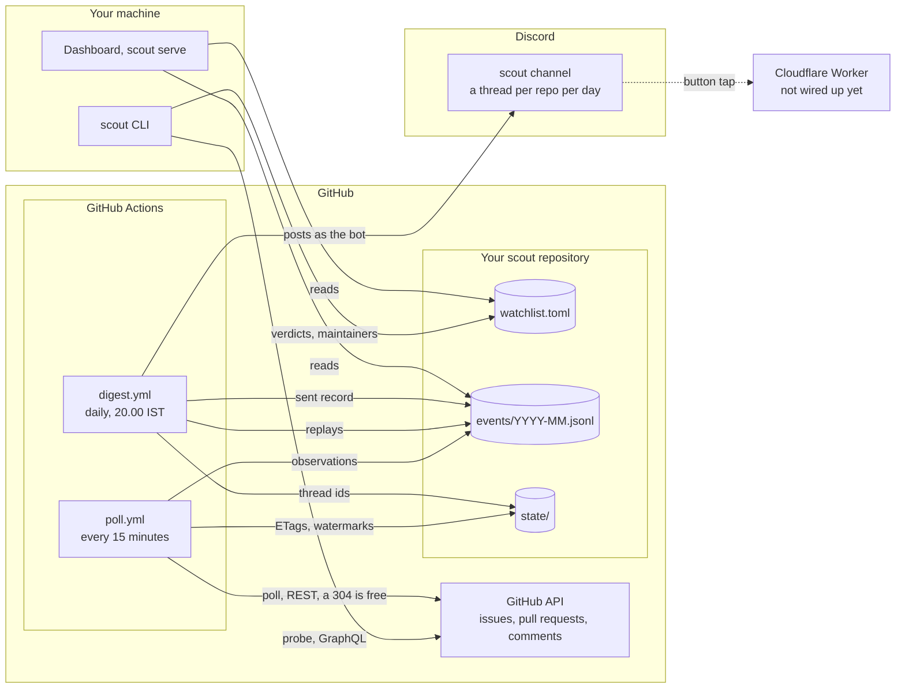
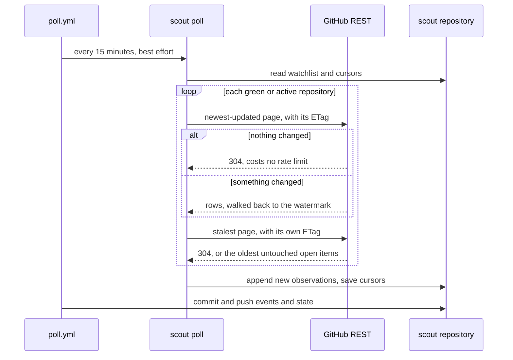
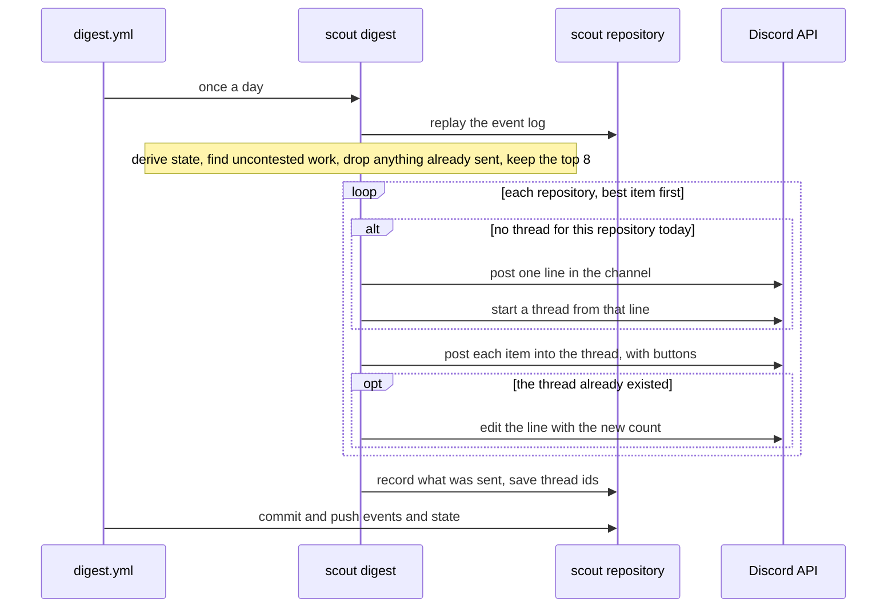
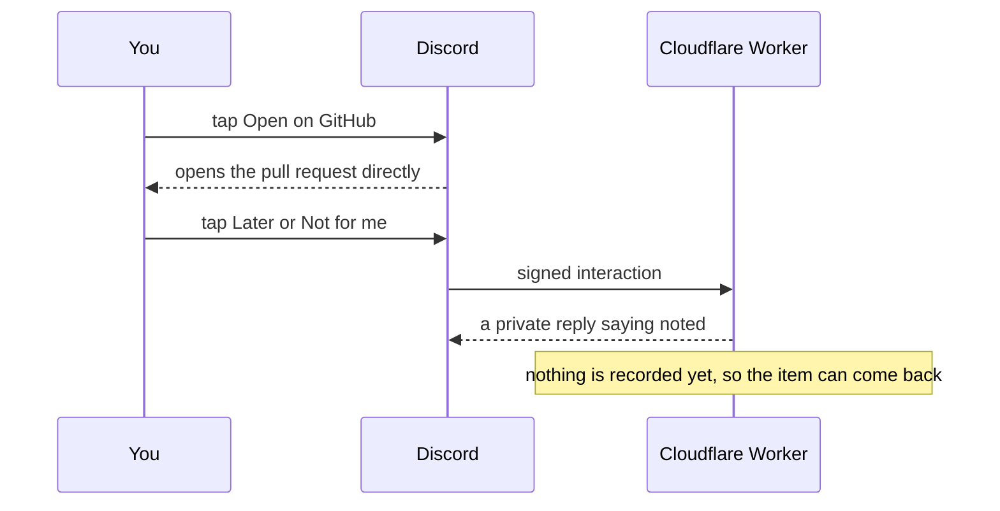

# Architecture

How the pieces connect and what runs when. For running it, see
[DOCUMENTATION.md](DOCUMENTATION.md). For why it is built this way, see
[DECISIONS.md](DECISIONS.md).

---

## At a glance

Three things move, and each has one job:

| | Job | Triggered by |
|---|---|---|
| **Probe** | Decide whether a repository is worth your time | You, on demand |
| **Poll** | Record what changed on the repositories you watch | A cron, every 15 minutes |
| **Digest** | Tell you about it once, when you can act | A cron, once a day |

Everything else reads what those three wrote. The dashboard, `scout list`, `scout events`
and `scout replay` never call GitHub on their own.

All state is ordinary files in the repository. The Actions workflows commit their changes
back, so git is the database, and you need `git pull` locally to see what they recorded.

---

## Polling, crons and webhooks

These terms get mixed up, and scout uses each for something different.

**GitHub never calls scout.** GitHub can send webhooks about a repository, but only to
someone with admin rights on it. Scout watches other people's repositories, so it cannot
receive webhooks from them and has to go and look instead. That is the poll.

**A cron is what makes the looking happen.** GitHub Actions has a `schedule:` trigger that
runs a workflow on a cron expression. `poll.yml` runs `*/15 * * * *`; `digest.yml` runs
`30 14 * * *`, which is 20:00 IST. Both can also be started by hand from the Actions tab.

**Webhooks only appear at the Discord end**, and there are two kinds:

| | Direction | Used for |
|---|---|---|
| Channel webhook | scout → Discord | Plain notifications when no bot is configured. Cannot carry buttons |
| Interactions endpoint | Discord → the Worker | Button taps. Discord calls a public HTTPS address and signs each request |

When a bot token and channel id are set, scout does not use the channel webhook at all.
It posts through Discord's API as the bot, which is what makes threads and buttons possible.

---

## Probe

**Runs:** `scout probe`, `scout add`, `scout refresh`, or the dashboard's probe buttons.
Locally, whenever you ask.

**Reads GitHub through GraphQL**, three queries per repository:

1. Merged pull requests, 100 per page, walking up to `SCOUT_PROBE_PAGES` pages (default 4,
   raise with `--pages`) or until the 180-day window is covered
2. Issues with their comments, 60 per page, walked the same way
3. One page of the least recently updated open issues and open pull requests

**Works out:** the share of merges that were somebody's first, with a confidence interval;
who the maintainers are, from who merged things; reply times; the maintainers' timezone;
and a live preview of uncontested work. That becomes a verdict: `GOOD`, `VIABLE`, `THIN`,
`TRAP` or `DEAD`.

**Writes:** the repository's entry in `watchlist.toml`, including the maintainer set,
which the poll side needs later. A probe from the dashboard also appends a
`probe_completed` event, so opening that repository afterwards costs nothing.

**Guards:** `refresh` skips anything probed in the last 14 days. From the dashboard a probe
has a 90-second deadline and only one runs at a time.

---

## Poll

**Runs:** `poll.yml` every 15 minutes in Actions, `scout poll` locally, or the dashboard's
"Check for changes".

**Which repositories:** only those whose status is `green` or `active` and whose `poll`
field is true, and at most 25 (`SCOUT_MAX_POLL_REPOS`).

**Reads GitHub through REST**, from one endpoint that returns issues and pull requests
together:

- **The newest end:** sorted by last update, newest first, 100 rows per page, up to 5
  pages, stopping as soon as it reaches rows it has seen before. This catches what changed.
- **The stalest end:** one page sorted oldest first, open items only. The newest end can
  never reach these on a busy repository, and they are the abandoned work scout exists to
  find.

Each end has a fixed address and its own ETag. When nothing has changed GitHub answers 304,
and that does not count against the rate limit, so an idle repository costs nothing to
check.

**Writes:**

- `events/YYYY-MM.jsonl`: one observation per issue or pull request version it saw. An
  observation's id is derived from what was seen, not when, so overlapping runs write each
  one once
- `state/cursors.json`: each repository's two ETags and its watermark

**Guards:** a 180-second deadline over the whole run, a stop 500 requests short of the rate
limit, the repository cap, the `SCOUT_ENABLED` kill switch, and a 10-minute job timeout in
Actions. Two scheduled runs never overlap.

---

## Derive

Not a separate process: every command that needs current state replays the event log
through `scout/derive.py`, which is a pure function.

From the observations it rebuilds the latest known state of every issue and pull request,
the transitions between consecutive observations (unassigned, labelled, merged, closed,
reopened, left draft), and the uncontested work:

| Kind | Rule |
|---|---|
| `unassigned` | Somebody was assigned and no longer is, within the last 36 hours |
| `stale-assignment` | Open, assigned, untouched for 21 days |
| `abandoned-pr` | Open, not a draft, untouched for 30 days, not by a maintainer |
| `unanswered-report` | Opened by an outsider, no comments, between 24 hours and 14 days old |

"Maintainer" comes from the set the last probe stored on the watchlist entry, so a
maintainer's own stale pull request is never offered to you. Beginner-labelled issues are
excluded on purpose.

Nothing derived is stored. Delete it and `scout replay --check` rebuilds it identically.

---

## Digest

**Runs:** `digest.yml` daily at 14:30 UTC, or `scout digest --send`.

**Choosing what to send:** transitions from the last 36 hours come first, then the
longest-idle work, then anything already sent or hidden is removed and the top 8 are kept.
"Already sent" is a `notification_sent` event in the log, and hiding an item in the
dashboard writes the same kind of event, so the two never disagree.

**Delivering it:**

- **As the bot** (token and channel id set): the channel gets one line per repository per
  day, such as `14 Sep - BerriAI/litellm (8)`. That repository's items go in a thread
  started from that line, each as its own message with buttons. A second send on the same
  day adds to the existing thread and updates the count. The day is taken in
  `SCOUT_DISPLAY_TZ`, and thread ids are kept in `state/discord_threads.json` for a week.
- **By webhook** (no bot configured): a single message with every item as an embed and no
  buttons.
- **Paced either way.** Discord limits bursts per channel and publishes no numbers for it,
  so requests go a second apart, a bucket Discord reports empty is waited out, and a 429 is
  retried after the wait it names. Every wait is capped at 5 seconds and the whole send at
  120, so a long limit fails the run rather than hanging it.
- **A send that stops partway** records the items that did go out as sent, and the
  workflow commits that and the thread ids even though the run fails. The next run
  finishes in the same thread instead of repeating them.

**Writes:** a `notification_sent` event to the log, and `state/discord_threads.json`.

---

## Buttons

Each item in a thread carries three buttons, and they do not work the same way.

- **Open on GitHub** is a link. Discord opens it itself and nothing else is involved.
- **Later** and **Not for me** send an interaction to the address set as the app's
  Interactions Endpoint URL, which is meant to be `worker/`. Until the Worker is deployed
  and that address is set, Discord shows "This interaction failed".
- **Even when deployed, those two buttons do not yet record anything.** The Worker verifies
  the signature and replies, but nothing reaches the event log, so a hidden item can still
  appear in a later digest. The intended fix is for the Worker to trigger a small workflow
  that appends the same event the dashboard writes when you hide an item.

---

## Where state lives

| File | Holds | Written by | In git |
|---|---|---|---|
| `watchlist.toml` | Repositories, status, verdicts, maintainer sets | probe, add, refresh, mark, dashboard | yes |
| `events/YYYY-MM.jsonl` | Observations, probe results, sent and hidden records | poll, digest, dashboard | yes |
| `state/cursors.json` | ETags and watermarks per repository | poll | yes |
| `state/discord_threads.json` | Thread and line ids per repository per day, last 7 days | digest, as the bot | yes |
| `.env` | Tokens and settings for local runs | you | no |
| Repository secrets | Tokens for the Actions runs | you, in GitHub settings | no |

The event log only ever grows, and every derived view comes from it. The other files are
the working state that sits beside it.

---

## Local and deployed

| | Locally | Deployed in GitHub Actions |
|---|---|---|
| Probe | Whenever you run it | Not scheduled |
| Poll | Only when you run it | Every 15 minutes, best effort |
| Digest | Only when you run it | Daily at 20:00 IST |
| Dashboard | `scout serve`, localhost only | Not deployed |
| Tokens | `.env` | Repository secrets |

Both sides write the same files. The event log is append-only with content-derived ids,
so the two histories merge cleanly. `state/cursors.json` and `state/discord_threads.json`
are rewritten whole, so if a local run and an Actions run both change them, git reports a
conflict. Once Actions is running, let it own polling and the digest, and `git pull` before
running either locally.

---

## Limits

| | Value | Setting |
|---|---|---|
| Poll schedule | every 15 minutes, in practice often hours apart | `poll.yml` |
| Digest schedule | 14:30 UTC, 20:00 IST | `digest.yml` |
| Poll depth | 5 pages of 100 from the newest end, 1 page from the stalest | `SCOUT_POLL_PER_PAGE` |
| Probe depth | 4 pages, or `--pages` | `SCOUT_PROBE_PAGES` |
| Probe window | 180 days | `SCOUT_LOOKBACK_DAYS` |
| Re-probe after | 14 days | `SCOUT_REPROBE_AFTER_DAYS` |
| Probe deadline, dashboard | 90 seconds | `SCOUT_PROBE_DEADLINE_SECONDS` |
| Poll deadline | 180 seconds | `SCOUT_POLL_DEADLINE_SECONDS` |
| Rate-limit floor | stop with 500 requests left | `SCOUT_RATE_LIMIT_FLOOR` |
| Watched repositories | at most 25 | `SCOUT_MAX_POLL_REPOS` |
| Items per digest | 8 | `SCOUT_DIGEST_MAX_ITEMS` |
| Discord pacing | 1 second between requests | `SEND_INTERVAL` in `notify.py` |
| Discord waits | at most 5 seconds each, 3 retries on a 429 | `MAX_RATE_LIMIT_WAIT`, `RATE_LIMIT_RETRIES` |
| Digest send deadline | 120 seconds | `SEND_DEADLINE` |
| "Just came free" window | 36 hours | `SCOUT_TRANSITION_HOURS` |
| Thread auto-archive | 24 hours | fixed |
| Workflow job timeout | 10 minutes | the workflow files |

---

## Known gaps

- **Later and Not for me record nothing yet**, as described under Buttons.
- **Scheduled runs are late.** GitHub gives low priority to schedules; on this repository
  runs set for every 15 minutes have started between 2 and 6 hours apart. The digest only
  needs the log to be reasonably current by the evening, so this costs little, but do not
  expect 15-minute freshness.
- **Fine-grained tokens expire.** When `SCOUT_GITHUB_TOKEN` does, every scheduled poll
  fails at the "Poll the watchlist" step until the secret is replaced.
- **The Worker has an unused path** for claim and dispatch actions that calls a
  `dispatch.yml` workflow which does not exist. No button sends those actions today.
